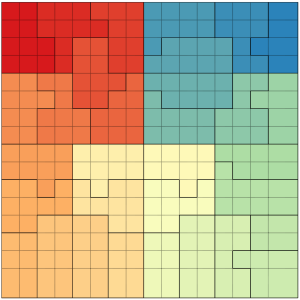

# 2020_scalable_algorithms
This repository contains a version of the LUE environmental modelling
framework as presented in our 2020 manuscript (work in progress),
as well as example scripts and other files used in the preparation of
that manuscript.

- De Jong, K., Karssenberg, D., Panja, D., Van Kreveld, M., A scalable
environmental modelling framework, using asynchronous many-tasks,
Computers and Geosciences (2020), submitted for review

The most recent LUE source code can be found in LUE's [own
repository](https://github.com/computationalgeography/lue).

## Build LUE modelling framework
...

## Use LUE modelling framework
...

## Run case-study model
...

