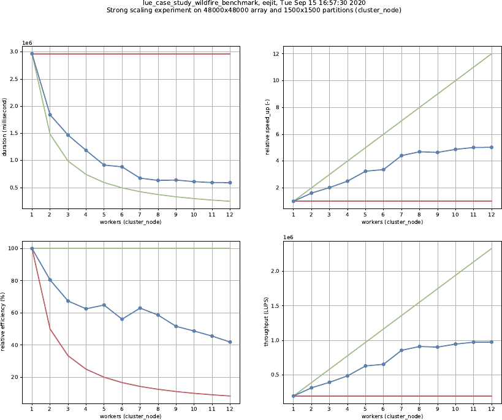

# 2020_scalable_algorithms
This repository contains a version of the LUE environmental modelling
framework as presented in our 2020 manuscript,
as well as example scripts and other files used in the preparation of
that manuscript.

- De Jong, K., Panja, D., Van Kreveld, M., Karssenberg, D.,
  An environmental modelling framework based on asynchronous many-tasks:
  scalability and usability,
  Environmental modelling & Software (2021), [10.1016/j.envsoft.2021.104998](https://doi.org/10.1016/j.envsoft.2021.104998)

| directory | contents |
| --------- | -------- |
| `lue` | Version of LUE described in manuscript |
| `lue/benchmark` | Settings and scripts related to experiments performed |
| `lue/source/framework` | Modelling framework source code |
| `output` | Outputs of scaling experiments performed |

The most recent LUE source code can be found in LUE's [own
repository](https://github.com/computationalgeography/lue).


## Build LUE modelling framework
LUE is currently developed and tested on Linux using GCC-7/9/10. All code
should compile and run fine on other platforms too, but this is not
regularly tested.

Here is an example session of building the version of LUE used for our
manuscript:

```bash
cd /tmp
# Recursive is used to also checkout submodules
git clone --recursive https://github.com/computationalgeography/paper_2020_scalable_algorithms
cd paper_2020_scalable_algorithms
mkdir build
cd build
cmake CMAKE_BUILD_TYPE=Release ..
cmake --build .
```

The LUE framework source code depends on 3rd party libraries and tools,
that may or may not be installed already on your system. The following
dependencies can usually be installed using your system's package manager,
using [Conan](https://conan.io), or using [Conda](https://conda.io):

| package | version used |
| ------- | ------------ |
| Boost | 1.72.0 |
| Docopt.cpp | 0.6.3 |
| GDAL | 2.2.3 |
| GooglePerfTools (TCMalloc) | 2.7 |
| HDF5 | 1.10.6 |
| hwloc | 1.11.8 |
| {fmt} | 7.0.3 |
| Microsoft GSL | 3.1.0 |
| MPI (OpenMPI) | 3.1 (4.0.4) |
| JSON for Modern C++ | 3.9.1 |

Other versions of these packages might also work. HPX is built during
the LUE build.

More information about building (the latest version of) LUE can be found
in [the LUE documentation](https://lue.computationalgeography.org/doc).


## Experiments
After building LUE, a set of command line utilities is available in
the build directory (`build/bin`). These accept a set of command line arguments that
determine the size of the problem that will be processed. Scripts have
been created that manage the execution of the experiments for various
kinds of experiments (partition shape, strong scaling, weak scaling),
for different platforms (cluster, desktop, laptop). Settings for these
can be found in [lue/benchmark/configuration](lue/benchmark/configuration).

Scripts for managing the experiments can be found in
[lue/benchmark/script/algorithm](lue/benchmark/script/algorithm).
The
[partition_shape_experiments.sh](lue/benchmark/script/algorithm/partition_shape_experiments.sh),
[strong_scaling_experiments.sh](lue/benchmark/script/algorithm/strong_scaling_experiments.sh),
and
[weak_scaling_experiments.sh](lue/benchmark/script/algorithm/weak_scaling_experiments.sh)
scripts perform the experiments for the operations and models
requested. Experiment results are stored in JSON files. Scripts for
importing these results in LUE datasets and generating plots can also
be found in
[lue/benchmark/script/algorithm](lue/benchmark/script/algorithm).

| experiment | executable | main source file |
| ---------- | ---------- | ---------------- |
| local operation | `lue_algorithm_sqrt_benchmark`       | [binary_local_operation.hpp](lue/source/framework/algorithm/include/lue/framework/algorithm/binary_local_operation.hpp) |
| focal operation | `lue_algorithm_focal_mean_benchmark` | [focal_operation.hpp](lue/source/framework/algorithm/include/lue/framework/algorithm/focal_operation.hpp) |
| zonal operation | `lue_algorithm_zonal_sum_benchmark`  | [zonal_operation.hpp](lue/source/framework/algorithm/include/lue/framework/algorithm/zonal_operation.hpp) |
| example model   | `lue_case_study_wildfire_benchmark`  | [wildfire_model_base.cpp](lue/source/framework/case_study/wildfire/src/wildfire_model_base.cpp) |

The source code of the experiments for the modelling operations can be
found in
[lue/source/framework/algorithm/benchmark](lue/source/framework/algorithm/benchmark).
The code implementing the wildfire model can be found in
[lue/source/framework/case_study/wildfire](lue/source/framework/case_study/wildfire).
The alternative implementation, using the
[PCRaster](https://pcraster.computationalgeography.org) environmental
modelling environment can be found in
[model/wildfire-pcraster.py](model/wildfire-pcraster.py).

Some outputs of the experiments performed can be found in the output
directory. For each experiment the output JSON files are stored, as well
as the scaling plots generated by the postprocessing scripts.


